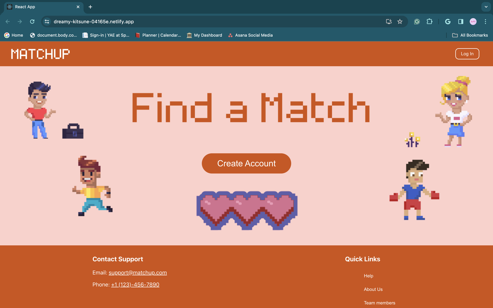
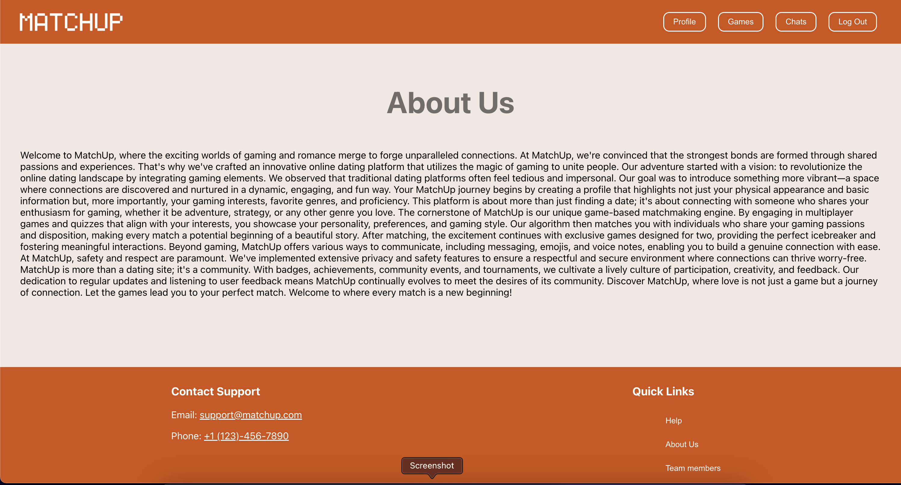
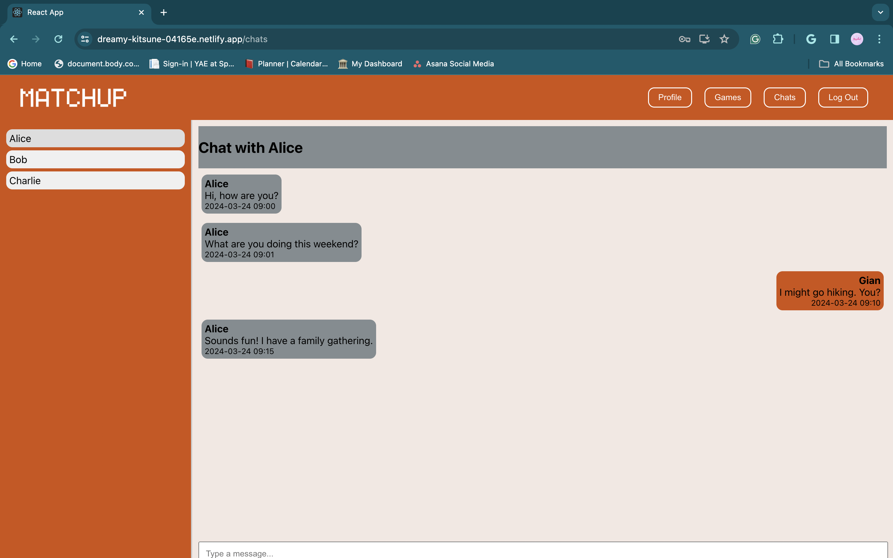
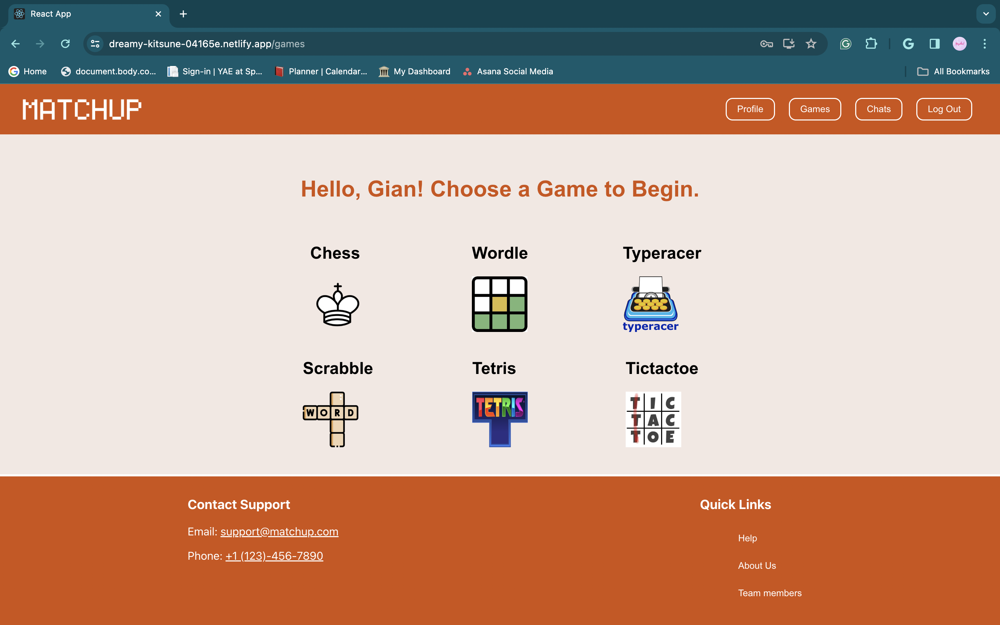
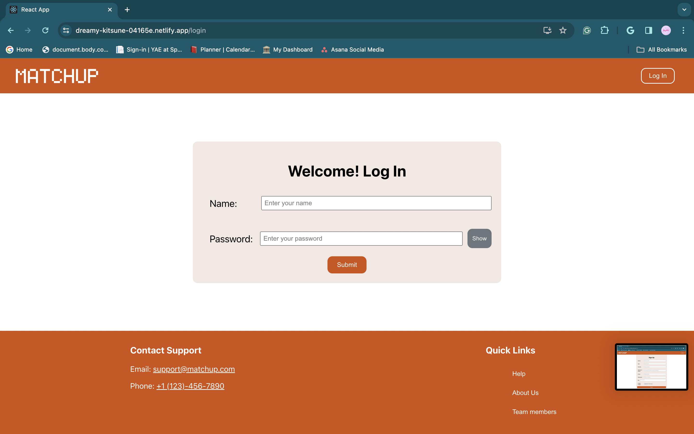
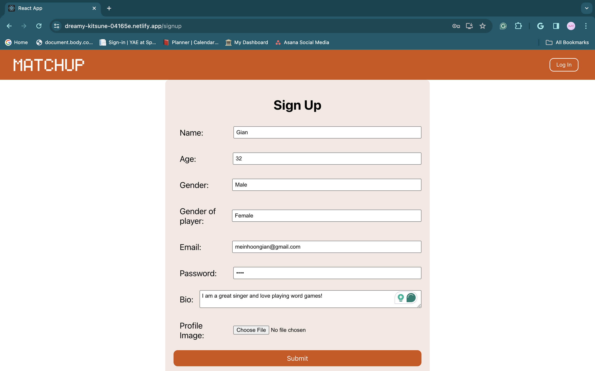
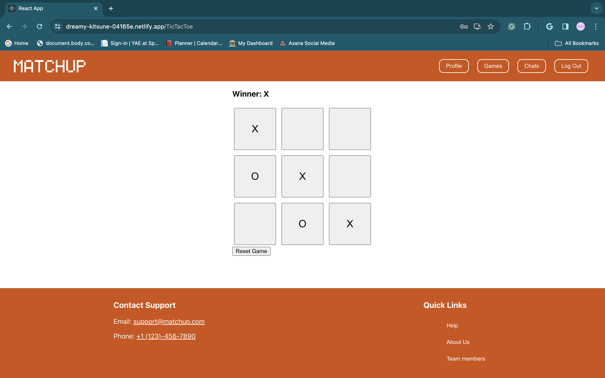
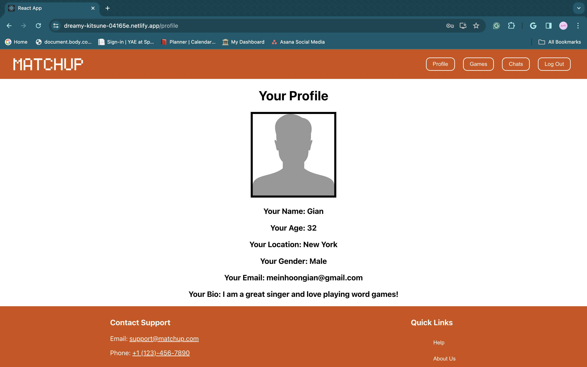

## [Try it out](https://dreamy-kitsune-04165e.netlify.app/)

# Getting Started with Create React App

This project was bootstrapped with [Create React App](https://github.com/facebook/create-react-app).

## Available Scripts

In the project directory, you can run:

### `npm start`

Runs the app in the development mode.\
Open [http://localhost:3000](http://localhost:3000) to view it in your browser.

The page will reload when you make changes.\
You may also see any lint errors in the console.

# Inspiration
Our project draws inspiration from the hackathon theme of clue by reimagining matchmaking through gaming. We believe traditional methods may overlook unconventional connections. By leveraging gaming and IQ, we aim to revolutionize how people are matched, tapping into unexplored avenues for meaningful connections.

# What it does
MatchUp is an innovative online dating platform that integrates gaming elements to match users based on their gaming interests and proficiency. Through multiplayer games, quizzes, and exclusive two-player games, it facilitates meaningful connections among individuals who share a passion for gaming.

# How we built it
We employed ReactJS to develop a dynamic and high-performance website. React Router Dom facilitated seamless navigation between pages. The utilization of Props served as a primary means of communication among various functions and pages. Additionally, foundational principles such as useState and useLocation were integral components of our implementation.

# Challenges we ran into
As newcomers to hackathons, our team faced numerous challenges, or "learning points," throughout the event. While experienced in web development, we navigated unfamiliar territory with React.js. Learning on the fly, we honed our skills, primarily focusing on front-end development due to limited backend knowledge. Despite this, we successfully implemented authentication and user data storage on the backend, marking significant progress in this experience.

# Accomplishments that we're proud of
At the outset, our initial focus was predominantly directed towards frontend development of the website. However, as we delved deeper into our project, we found ourselves substantially engaged in backend development as well. This unexpected pivot allowed us to hone our web development skills, particularly in areas where we previously lacked extensive experience. Our endeavors culminated in the successful implementation of fundamental authentication mechanisms, empowering users to create individual accounts seamlessly. Moreover, our journey led us to master the integration of our web application with various pre-existing technologies. Through this process, we not only expanded our technical repertoire but also gained invaluable insights into the intricacies of modern web development practices.

# What we learned
As newcomers, we gained insights into web development and the importance of pre-planning design ideas for hackathons. Despite technological limitations, we managed to deploy a functional website based on our skills. We now understand hackathon expectations better and aim to explore further to enhance our abilities and ideas in future events.

# What's next for MatchUp
During the recent hackathon, our team successfully developed the front-end interface for our project, laying a robust foundation for further development. Additionally, we initiated the backend implementation, setting up essential components to support upcoming functionalities. Moving forward, our roadmap entails integrating cutting-edge AI algorithms to facilitate candidate matching based on their gaming preferences and skills. Furthermore, we aim to implement custom game creation features, enabling users to tailor their gaming experience according to their preferences. Our vision for the upcoming year is to enhance user engagement by incorporating interactive features such as real-time chat functionalities and post-game connection capabilities, fostering a vibrant and dynamic gaming community. With a solid framework in place and ambitious plans for the future, we are poised to continue our journey towards creating an innovative and impactful gaming platform.

## Built With
css3, html5, javascript, npm, react

## [Try it out](https://dreamy-kitsune-04165e.netlify.app/)

# Snapshots from the website
### Home

### About Us

### Chat

### Games

### Login

### Signup

### TicTacToe Game

### Help 

### Profile

